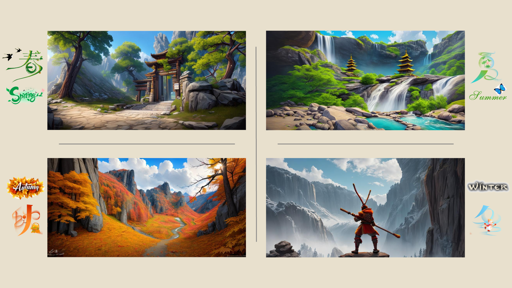

<div align="center">

# LinFusion
<a href="https://arxiv.org/abs/2409.02097"></a> 
<a  href="https://lv-linfusion.github.io"></a>
<a href="https://huggingface.co/spaces/Huage001/LinFusion-SD-v1.5"></a>
</div>


> **LinFusion: 1 GPU, 1 Minute, 16K Image**
> <br>
> [Songhua Liu](http://121.37.94.87/), 
> [Weuhao Yu](https://whyu.me/), 
> [Zhenxiong Tan](https://scholar.google.com/citations?user=HP9Be6UAAAAJ&hl=en), 
> and 
> [Xinchao Wang](https://sites.google.com/site/sitexinchaowang/)
> <br>
> [Learning and Vision Lab](http://lv-nus.org/), National University of Singapore
> <br>



## 🔥News

**[2024/12/23]** We release **CLEAR**, a dedicated solution for pre-trained **DiTs** like **FLUX** and **SD3** to accelerate high-resolution generation. Please checkout our [paper](https://arxiv.org/abs/2412.16112) and [code](https://github.com/Huage001/CLEAR).

**[2024/11/24]** LinFusion is supported by [triton implementation](https://github.com/hp-l33/flash-bidirectional-linear-attention), which is even much more efficient than previous naive one! We would like to extend sincere gratitude to @[hp-133](https://github.com/hp-l33) for the amazing work!

**[2024/09/28]** We release evaluation codes on the COCO benchmark! 

**[2024/09/27]** We successfully integrate LinFusion to [DistriFusion](https://github.com/mit-han-lab/distrifuser), an effective and efficient strategy for generating an image in parallel, and achieve more significant acceleration! Please refer to the example [here](https://github.com/Huage001/LinFusion/blob/main/examples/inference/sdxl_distrifusion_example.py)!

**[2024/09/26]** We enable **16K** image generation with merely **24G** video memory! Please refer to the example [here](https://github.com/Huage001/LinFusion/blob/main/examples/inference/superres_sdxl_low_v_mem.ipynb)!

**[2024/09/20]** We release **a more advanced pipeline for ultra-high-resolution image generation using SD-XL**! It can be used for [text-to-image generation](https://github.com/Huage001/LinFusion/blob/main/examples/inference/ultra_text2image_sdxl.ipynb) and [image super-resolution](https://github.com/Huage001/LinFusion/blob/main/examples/inference/superres_sdxl.ipynb)!

**[2024/09/20]** We release training codes for Stable Diffusion XL [here](https://github.com/Huage001/LinFusion/blob/main/src/train/distill_xl.py)!

**[2024/09/13]** We release LinFusion models for Stable Diffusion v-2.1 and Stable Diffusion XL!

**[2024/09/13]** We release training codes for Stable Diffusion v-1.5, v-2.1, and their variants [here](https://github.com/Huage001/LinFusion/blob/main/src/train/distill.py)!

**[2024/09/08]** We release codes for **16K** image generation [here](https://github.com/Huage001/LinFusion/blob/main/examples/inference/ultra_text2image_w_sdedit.ipynb)!

**[2024/09/05]** [Gradio demo](https://huggingface.co/spaces/Huage001/LinFusion-SD-v1.5) for SD-v1.5 is released! Text-to-image, image-to-image, and IP-Adapter are supported currently.

## Supported Models

1. `Yuanshi/LinFusion-1-5`: For Stable Diffusion v-1.5 and its variants. <a href="https://huggingface.co/Yuanshi/LinFusion-1-5"></a>
1. `Yuanshi/LinFusion-2-1`: For Stable Diffusion v-2.1 and its variants. <a href="https://huggingface.co/Yuanshi/LinFusion-2-1"></a>
1. `Yuanshi/LinFusion-XL`: For Stable Diffusion XL and its variants. <a href="https://huggingface.co/Yuanshi/LinFusion-XL"></a>


## Quick Start
* If you have not, install [PyTorch](https://pytorch.org/get-started/locally/) and [diffusers](https://huggingface.co/docs/diffusers/index).

* Clone this repo to your project directory:

  ``` bash
  git clone https://github.com/Huage001/LinFusion.git
  ```

* **You only need two lines!**

  ```diff
  from diffusers import AutoPipelineForText2Image
  import torch
  
  + from src.linfusion import LinFusion
  
  sd_repo = "Lykon/dreamshaper-8"
  
  pipeline = AutoPipelineForText2Image.from_pretrained(
      sd_repo, torch_dtype=torch.float16, variant="fp16"
  ).to(torch.device("cuda"))
  
  + linfusion = LinFusion.construct_for(pipeline)
  
  image = pipeline(
      "An astronaut floating in space. Beautiful view of the stars and the universe in the background.",
      generator=torch.manual_seed(123)
  ).images[0]
  ```
  `LinFusion.construct_for(pipeline)` will return a LinFusion model that matches the pipeline's structure. And this LinFusion model will **automatically mount to** the pipeline's forward function.

* `examples/inference/basic_usage.ipynb` shows a basic text-to-image example.

## Gradio Demo

* Currently, you can try LinFusion for SD-v1.5 online [here](https://huggingface.co/spaces/Huage001/LinFusion-SD-v1.5). Text-to-image, image-to-image, and IP-Adapter are supported currently.
* We are building Gradio local demos for more base models and applications, so that everyone can deploy the demos locally.

## Ultrahigh-Resolution Generation

From the perspective of efficiency, our method supports high-resolution generation such as 16K images. Nevertheless, directly applying diffusion models trained on low resolutions for higher-resolution generation can result in content distortion and duplication. To tackle this challenge, we apply following techniques:

* [SDEdit](https://huggingface.co/docs/diffusers/v0.30.2/en/api/pipelines/stable_diffusion/img2img#image-to-image). **The basic idea is to generate a low-resolution result at first, based on which we gradually upscale the image.**

  **Please refer to `examples/inference/ultra_text2image_w_sdedit.ipynb` for an example.**

* [DemoFusion](https://github.com/PRIS-CV/DemoFusion). It also generates high-resolution images from low-resolution results. Latents of the low-resolution generation are reused for high-resolution generation. Dilated convolutions are involved. Compared with the original version:

  1. We can generate high-resolution directly with the help of LinFusion instead of using patch-wise strategies. 
  2. Insights in SDEdit are also applied here, so that the high-resolution branch does not need to go through full denoising steps.
  3. Image are upscaled to 2x, 4x, 8x, ... resolutions instead of 1x, 2x, 3x, ...

  **Please refer to `examples/inference/ultra_text2image_sdxl.ipynb` for an example of high-resolution text-to-image generation** (first generate 1024 resolution, then generate 2048, 4096, 8192, etc) **and `examples/inference/superres_sdxl.ipynb` for an example of image super resolution** (directly upscale to the target resolution, generally 2x is recommended and using it multiple times if you want higher scales). 


* Above codes for 16K image generation require a GPU with 80G video memory. **If you encounter OOM issues, you may consider `examples/inference/superres_sdxl_low_w_mem.ipynb`, which requires only 24G video memory.** We achieve this by 1) chunked forward of classifier-free guidance inference, 2) chunked forward of feed-forward network in Transformer blocks, 3) in-placed activation functions in ResNets, and 4) caching UNet residuals on CPU.

* [DistriFusion](https://github.com/mit-han-lab/distrifuser). Alternatively, if you have multiple GPU cards, you can try integrating LinFusion to DistriFusion, which achieves **more significant acceleration due to its linearity and thus almost constant communication cost**. You can run an minimal example with:

  ```bash
  torchrun --nproc_per_node=$N_GPUS -m examples.inference.sdxl_distrifusion_example
  ```
  
* We are working on integrating LinFusion with more advanced approaches that are dedicated on high-resolution extension! **Feel free to create pull requests if you come up with better solutions!**

## Training

* Before training, make sure you have the packages shown in `requirements.txt` installed:

  ```bash
  pip install -r requirements.txt
  ```

* Training codes for Stable Diffusion v-1.5, v-2.1, and their variants are released in `src/train/distill.py`. We present an exampler running script in `examples/train/distill.sh`. You can run it on a 8-GPU machine via:

  ```bash
  bash ./examples/training/distill.sh
  ```

  The codes will download `bhargavsdesai/laion_improved_aesthetics_6.5plus_with_images` [dataset](https://huggingface.co/datasets/bhargavsdesai/laion_improved_aesthetics_6.5plus_with_images) automatically to `~/.cache` directory by default if there is not, which contains 169k images and requires ~75 GB disk space.

  We use fp16 precision and 512 resolution for Stable Diffusion v-1.5 and bf16 precision and 768 resolution for Stable Diffusion v-2.1.

* Training codes for Stable Diffusion XL are released in `src/train/distill_xl.py`. We present an exampler running script in `examples/train/distill_xl.sh`. You can run it on a 8-GPU machine via:

  ```bash
  bash ./examples/training/distill_xl.sh
  ```

## Evaluation

Following [GigaGAN](https://github.com/mingukkang/GigaGAN/tree/main/evaluation), we use 30,000 COCO captions to generate 30,000 images for evaluation. FID against COCO val2014 is reported as a metric, and CLIP text cosine similarity is used to reflect the text-image alignment.

* To evaluate LinFusion, first install the required packages:

  ```bash
  pip install git+https://github.com/openai/CLIP.git
  pip install click clean-fid open_clip_torch
  ```

* Download and unzip COCO val2014 to `/path/to/coco`:

  ```bash
  wget http://images.cocodataset.org/zips/val2014.zip
  unzip val2014.zip -d /path/to/coco
  ```

* Run `examples/eval/eval.sh` to generate images for evaluation. You may need to specify `outdir`, `repo_id`, `resolution`, etc.

  ```bash
  bash examples/eval/eval.sh
  ```

* Run `examples/eval/calculate_metrics.sh` to calculate the metrics. You may need to specify `/path/to/coco`, `fake_dir`, etc.

  ```bash
  bash examples/eval/calculate_metrics.sh
  ```

## ToDo

- [x] Stable Diffusion 1.5 support.
- [x] Stable Diffusion 2.1 support. 
- [x] Stable Diffusion XL support.
- [x] Release training code for LinFusion.
- [x] Release evaluation code for LinFusion.
- [ ] Gradio local interface.

## Acknowledgement

* We extend our gratitude to the authors of [SDEdit](https://huggingface.co/docs/diffusers/v0.30.2/en/api/pipelines/stable_diffusion/img2img#image-to-image), [DemoFusion](https://github.com/PRIS-CV/DemoFusion), and [DistriFusion](https://github.com/mit-han-lab/distrifuser) for their contributions, which inspire us a lot on applying LinFusion for high-resolution generation. 
* Our evaluation codes are adapted from [SiD-LSG](https://github.com/mingyuanzhou/SiD-LSG) and [GigaGAN](https://github.com/mingukkang/GigaGAN/tree/main/evaluation).
* We thank [@Adamdad](https://github.com/Adamdad), [@yu-rp](https://github.com/yu-rp), and [@czg1225](https://github.com/czg1225) for valuable discussions.

## Citation

If you finds this repo is helpful, please consider citing:

```bib
@article{liu2024linfusion,
  title     = {LinFusion: 1 GPU, 1 Minute, 16K Image},
  author    = {Liu, Songhua and Yu, Weihao and Tan, Zhenxiong and Wang, Xinchao},
  year      = {2024},
  eprint    = {2409.02097},
  archivePrefix={arXiv},
  primaryClass={cs.CV}
}
```
